### YOLOv7: Trainable bag-of-freebies sets new state-of-the-art for real-time object detectors

> 原始题目：YOLOv7: Trainable bag-of-freebies sets new state-of-the-art for real-time object detectors
> 
> 中文翻译：YOLOv7: 可训练的免费包为实时目标检测器设置了最新的技术
>
> 发表时间：2022年7月6日
> 
> 平台：arXiv
> 
> 来源：中央研究院资讯科学研究所，台湾
>
> 文章链接：[YOLOv7](https://arxiv.org/pdf/2207.02696.pdf)
>
> 开源代码：[YOLOv7](https://github.com/WongKinYiu/yolov7)

>  Alexey Bochkovskiy 大神亲自背书。

##  摘要

在 5 FPS 到 160 FPS 的范围内，YOLOv7 在 speed 和  accuracy 上都超过了所有已知的目标检测器，并且在 GPU V100 上 30 FPS 或更高的实时目标检测器中，YOLOv7 有最高的 56.8% AP的 accuracy。YOLOv7-E6 目标检测器( 56FPS V100，55.9%AP ) 比基于  transformer 的检测器 SWINL Cascade-MASK R-CNN(9.2 FPS A100，53.9%AP)  的 speed 快 509%， accuracy 高2%；比基于卷积的检测器 ConvNeXt-XL Cascade-MASK R-CNN(8.6 FPS A100，55.2%AP) speed 快 551%， accuracy 高 0.7%；YOLOv7性能优于：YOLOR、YOLOX、Scaled-YOLOv4、YOLOv5、DETR、 Deformable DETR、Dino-5Scale-R50、R50VIT-Adapter-B 和许多其他目标检测器的 speed 和 accuracy。此外，我们仅在MS Coco数据集上从头开始训练YOLOv7，而不使用任何其他数据集或预训练的权重。  

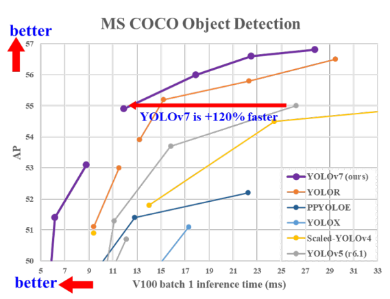

图 1：与其他实时目标检测器的比较，我们提出的方法实现了最先进的性能。

## 6. 结论
   
本文提出了一种新的实时目标检测器的架构和相应的模型缩放（scaling）方法。此外，我们发现，目标检测方法的演变过程产生了新的研究课题。在研究过程中，我们发现了 re-parameterized 模块的替换问题和动态标签分配的分配问题。为了解决这一问题，我们提出了可训练的  bag-of-freebies 方法来提高目标检测的 accuracy 。在此基础上，开发了YOLOv7系列目标检测系统，取得了最先进的检测结果。

## 1.引言

实时目标检测是计算机视觉中一个非常重要的课题，因为它往往是计算机视觉系统中必不可少的组成部分。例如，多目标跟踪[94，93]、自动驾驶[40，18]、机器人[35，58]、医学图像分析[34，46]等。执行实时对象检测的计算设备通常是一些移动CPU或GPU，以及由主要制造商开发的各种神经处理单元(NPU)。例如，苹果神经引擎(Apple)、神经计算棒(Intel)、 Jetson AI edge devices (Nvidia)、 the edge TPU(Google)、神经处理引擎(Qualcomm)、AI处理单元(MediaTek)、AI SoCs(Kneron)，都是NPU。上面提到的一些边缘设备专注于加速不同的运算，如 vanilla 卷积、 depth-wise 卷积或 MLP 运算。在本文中，我们提出的实时目标检测器主要是希望它能够同时支持从边缘到云的移动GPU和GPU设备。

近年来，实时目标检测器仍在针对不同的边缘设备进行开发。例如，MCUNet [49, 48] 和 NanoDet [54] 的开发专注于生产低功耗单芯片并提高边缘 CPU 的推理速度。至于 YOLOX [21] 和 YOLOR [81] 等方法，他们专注于提高各种 GPU 的推理速度。最近，实时目标检测器的发展集中在高效架构的设计上。至于可以在 CPU [54, 88, 84, 83] 上使用的实时目标检测器，他们的设计主要基于 MobileNet [28, 66, 27]、ShuffleNet [92, 55] 或 GhostNet [25] 。另一个主流的实时目标检测器是为 GPU [81, 21, 97] 开发的，它们大多使用 ResNet [26]、DarkNet [63] 或 DLA [87]，然后使用 CSPNet [80] 策略来优化架构。本文提出的方法的发展方向与当前主流的实时目标检测器不同。除了架构优化之外，我们提出的方法将专注于训练过程的优化。我们的重点将放在一些优化的模块和优化方法上，它们可能会增加训练成本以提高目标检测的准确性，但不会增加推理成本。我们将提出的模块和优化方法称为可训练的 bag-of-freebies 。

 最近，模型  re-parameterization [13,12,29]和动态标签分配[20,17,42]已成为网络训练和目标检测的重要课题。 主要是在上述新概念提出之后，物体检测器的训练演变出了很多新的问题。 在本文中，我们将介绍我们发现的一些新问题，并设计解决这些问题的有效方法。 对于模型 re-parameterization，我们用梯度传播路径的概念分析了适用于不同网络层的模型 re-parameterization 策略，并提出了 planned  re-parameterization 模型。 此外，当我们发现使用动态标签分配技术时，具有多个输出层的模型的训练会产生新的问题。 即：“如何为不同分支的输出分配动态目标？” 针对这个问题，我们提出了一种新的标签分配方法，称为从粗到细的引导式（ coarse-to-fine lead guided）标签分配。

本文的主要贡献如下：

- 设计了几种可训练的 bag-of-freebies 方法，使得实时目标检测可以在不增加推理代价的情况下大大提高检测 accuracy；\
- 在目标检测方法的演变过程中，我们发现了两个新的问题，即 re-parameterized 模块如何取代原有的模块，以及动态标签分配策略如何处理不同输出层的分配。此外，我们还提出了解决这些问题的方法；
- 提出了能够有效利用参数和计算量的实时目标检测器的“扩展（ extend）”和“复合缩放（compound scaling）”方法；
- 我们提出的方法可以有效地减少现有实时目标检测器约40%的参数和50%的计算量，并且具有更快的推理速度和更高的检测精度。

## 2. 相关工作

### 2.1 实时目标检测器

目前最先进的实时目标检测器主要基于YOLO[61，62，63]和FCOS[76，77]，它们是[3，79，81，21，54，85，23]。要成为最先进的实时目标检测器通常需要以下特征：

- 更快、更强大的网络架构；
- 更有效的特征集成方法[22、97、37、74、59、30、9、45]；
- 更 accurate 的检测方法[76、77、69]；
- 更健壮的损失函数[96、64、6、56、95、57]；
- 更高效的标签分配方法[99、20、17、82、42]；
- 更有效的训练方法。

 在本文中，我们不打算探索需要额外数据或大模型的自我监督学习（self-supervised learning ）或知识蒸馏（ knowledge distillation）方法。取而代之的是，我们将设计新的可训练的 bag-of-freebies 方法，以解决上述(4)、(5)和(6)相关的最先进方法产生的问题。

### 2.2. 模型 re-parameterization

模型 re-parameterization 技术[71，31，75，19，33，11，4，24，13，12，10，29，14，78]在推理阶段将多个计算模块合并为一个。模型 re-parametrization 技术可以看作是一种集成技术，可以分为两类，即模块级集成和模型级集成。

为了获得最终的推理模型，有两种常见的模型级 re-parameterization 的做法。一种是用不同的训练数据训练多个相同的模型，然后对多个训练模型的权值进行平均。另一种方法是对不同迭代次数的模型权重进行加权平均。

模块级 re-parameterization 是近年来比较热门的研究课题。这种方法在训练过程中将一个模块拆分成多个相同或不同的模块分支，在推理过程中将多个分支模块集成到一个完全等价的模块中。然而，并不是所有提出的 re-parameterized 模块都能完美地应用于不同的架构。有鉴于此，我们开发了新的 re-parameterization 模块，并针对不同的架构设计了相关的应用策略。

### 2.3.模型缩放

模型缩放[72，60，74，73，15，16，2，51]是一种放大或缩小已经设计的模型并使其适合不同计算设备的方法。模型缩放方法通常使用不同的缩放因子，如分辨率(输入图像的大小)、深度(层数)、宽度(通道数)和阶段(特征金字塔数)，以便在网络参数的数量、计算量、推理速度和 accuracy 之间取得良好的折衷。

网络架构搜索(NAS)是一种常用的模型缩放方法。NAS可以自动从搜索空间中搜索合适的缩放因子，而不需要定义太复杂的规则。NAS的缺点是需要非常昂贵的计算来完成模型缩放因子的搜索。在[15]中，研究人员分析了缩放因子与参数和运算量之间的关系，试图直接估计一些规律，从而得到模型缩放所需的缩放因子。查阅文献，我们发现几乎所有的模型缩放方法都是独立分析单个缩放因子的，即使是复合缩放范畴的方法也是独立优化缩放因子的。这是因为大多数流行的NAS架构处理的缩放因子不是很相关。我们观察到，所有基于串联（ concatenation）的模型，如DenseNet[32]或VoVNet[39]，当这些模型的深度被缩放时，将改变某些层的输入宽度。由于所提出的架构是基于串联（concatenation）的，因此我们必须为该模型设计一种新的复合缩放方法。

## 3. 架构
### 3.1. 扩展的高效层聚合网络

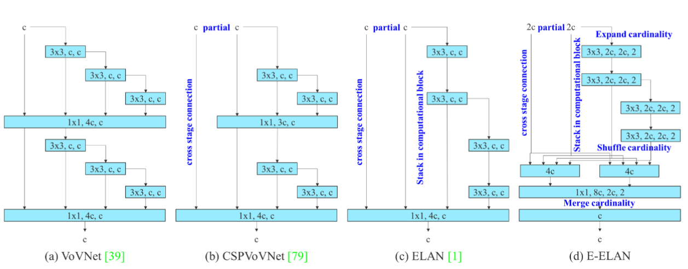

图2：扩展的高效层聚合网络。提出的 extended ELAN (E-ELAN) 完全不改变原架构的梯度传输路径，而是利用分组卷积来增加所增加特征的基数（cardinality），并将不同分组的特征以一个 shuffle 和  merge 基数的方式组合在一起。这种操作方式可以增强不同特征图学习的特征，提高参数和计算的使用。 

在大多数关于设计高效架构的文献中，主要的考虑是不超过 参数的数量、计算量和计算密度。从存储器访问成本的特点出发，Ma等人提出了一种新的解决方案。[55]分析了输入输出通道比、架构分支数、 element-wise 运算对网络推理速度的影响。 Doll ́ar等人[15]此外，还考虑了在执行模型缩放时的 activation，即更多地考虑卷积层输出张量中的元素数量。图2(B)中的CSPVoVNet[79]设计是VoVNet[39]的变体。除了考虑上述基本设计问题外，CSPVoVNet[79]的架构还分析了梯度路径，以便使不同层的权重学习更多样化的特征。上述梯度分析方法使推断更快、更 accurate。图2(C)中的Elan[1]考虑了以下设计策略：“如何设计一个高效的网络？”他们得出一个结论：通过控制最短最长的梯度路径，一个更深的网络可以有效地学习和收敛。在本文中，我们提出了基于ELAN的 Extended-ELAN (E-ELAN)，其主要结构如图2(D)所示。

无论梯度路径长度和大规模 ELAN 中计算块的堆叠数量如何，它都达到了稳定状态。如果无限堆叠更多的计算块，可能会破坏这种稳定状态，参数利用率会降低。提出的 E-ELAN 使用expand、shuffle、merge cardinality来实现在不破坏原有梯度路径的情况下不断增强网络学习能力的能力。在架构方面，E-ELAN 只改变了计算块的架构，而过渡（transition）层的架构完全没有改变。我们的策略是使用组卷积来扩展计算块的通道和基数。我们将对计算层的所有计算块应用相同的组参数和通道乘数（multiplier）。然后，每个计算块计算出的特征图会根据设置的组参数 g 被 shuffled 成 g 个组，然后将它们连接（concatenate）在一起。此时，每组特征图的通道数将与原始架构中的通道数相同。最后，我们添加 g 组特征图来执行合并基数（cardinality）。除了保持原有的 ELAN 设计架构，E-ELAN 还可以引导不同组的计算块学习更多样化的特征。

### 3.2.基于级联（concatenation）模型的模型缩放

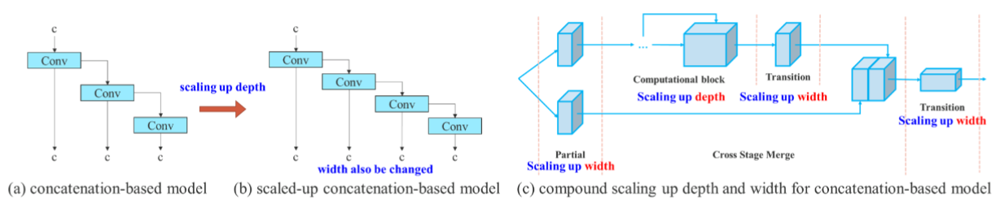

图3:基于 concatenation 的模型的模型 scaling 。从(a)到(b)，我们观察到当对基于级联的模型进行深度缩放时，计算块的输出宽度也会增加。这种现象会导致后续传输层的输入宽度增大。因此，我们提出(c)，即对基于级联的模型进行模型缩放时，只需要对计算块中的深度进行缩放，其余的传输层进行相应的宽度缩放。

模型缩放的主要目的是调整模型的一些属性，生成不同 scales 的模型，以满足不同推理速度的需求。例如，EfficientNet [72] 的缩放模型考虑了宽度、深度和分辨率。至于 scaled-YOLOv4 [79]，其缩放模型是调整阶段数。在 [15] 中，Doll ́ar 等人分析了 vanilla 卷积和组卷积在进行宽度和深度缩放时对参数量和计算量的影响，并以此设计了相应的模型缩放方法。上述方法主要用于PlainNet或ResNet等架构。这些架构在执行扩容或缩容时，每一层的入度（in-degree）和出度（ out-degree）都不会发生变化，因此我们可以独立分析每个缩放因子对参数量和计算量的影响。但是，如果将这些方法应用于基于 concatenation 的架构，我们会发现，当对深度进行放大或缩小时，紧接基于 concatenation 的计算块之后的 translation 层的入度（in-degree）会减小或增加，如图3（a）和（b）所示。

从上述现象可以推断，对于基于 concatenation 的模型，我们不能单独分析不同的缩放因子，而必须一起考虑。以按比例放大深度为例，这种行为会导致过渡层的输入通道和输出通道的比例变化，从而导致模型的硬件使用量下降。因此，对于基于级联的模型，我们必须提出相应的复合模型缩放方法。当我们缩放一个计算块的深度因子时，我们还必须计算该块输出通道的变化。然后，我们将对 transition 层进行相同变化量的宽度因子缩放，结果如图3 (c)所示。我们提出的复合缩放方法可以保持模型在初始设计时的属性，并保持最优结构。

## 4. 可训练的bag-of-freebies
### 4.1  Planned re-parameterized 卷积

虽然RepConv[13]在VGG上已经取得了优异的性能[68]，但当我们将其直接应用于ResNet[26]和DenseNet[32]等架构时，其精度会显著降低。我们用梯度流传播路径来分析如何将 re-parameterized 的卷积与不同的网络相结合。并据此设计了 planned  re-parameterized 卷积。

RepConv实际上是在一个卷积层中结合了 3 × 3卷积、1 × 1卷积和 identity 连接。通过分析RepConv与不同架构的结合及其性能，我们发现RepConv中的 identity 连接破坏了ResNet中的残差和DenseNet中的拼接（concatenation），残差和拼接为不同的特征图提供了更多的梯度多样性。基于上述原因，我们使用无  identity 连接的  RepConv (RepConvN)来设计 planned re-parameterized 卷积的架构。在我们的思维中，当一个带有残差或拼接的卷积层被 re-parameterized 的卷积所取代时，应该不存在 identity 连接。图4 显示了我们设计的在PlainNet和ResNet中使用的“规划的重新参数化卷积”的示例。关于基于残差模型和基于级联模型的完整规划的重新参数化卷积实验，将在消融研究环节中进行介绍。

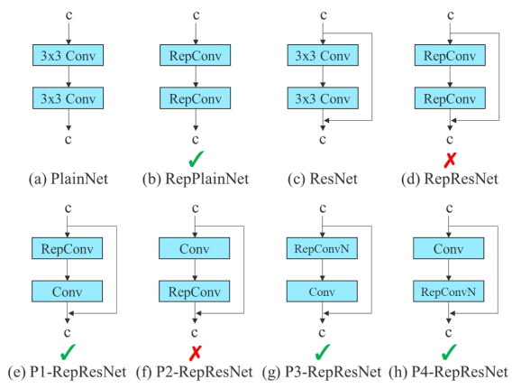 

图4：Planned re-parameterized 模型。在提出的 planned re-parameterized 模型中，我们发现一个带有 residual 或 concatenation 连接的层，其 RepConv 不应该有恒等（identity）连接。 在这些情况下，它可以被不包含 identity 连接的 RepConvN 替换。

### 4.2. Coarse（粗） for auxiliary（辅助） and fine（细） for lead loss

深度监督[38]是一种经常用于训练深层网络的技术。其主要思想是在网络的中间层增加额外的辅助（auxiliary）头，以 assistant loss 为指导的浅层网络加权。即使对于ResNet[26]和DenseNet[32]这样通常收敛良好的架构，深度监督[70、98、67、47、82、65、86、50]仍然可以显著提高模型在许多任务上的性能。图5(A)和(B)分别示出了目标检测器架构，分别为 无深度监督和 有深度监督。在本文中，我们将负责最终输出的头称为主导头（ lead head），用于辅助训练的头称为辅助头（auxiliary head）。

接下来，我们想讨论一下标签分配问题。过去，在深度网络的训练中，标签分配通常直接参考 the ground truth ，并根据给定的规则生成硬标签。然而，近年来，如果我们以目标检测为例，研究人员往往利用网络输出的预测的质量和分布，然后结合地面实际情况，使用一些计算和优化方法来生成可靠的软标签[61，8，36，99，91，44，43，90，20，17，42]。例如，YOLO[61]使用包围盒回归预测和地面事实的借条作为客观性的软标签。在本文中，我们将网络预测结果与地面真实情况结合起来，然后将软标签分配为“标签分配器”。

无论 auxiliary head 或 lead head 的情况如何，都需要对目标对象进行深度监督训练。在开发软标签分配器（ soft label assigner）相关技术的过程中，我们偶然发现了一个新的衍生问题，即：如何为辅助头（ auxiliary head）和引导头（ lead head）分配软标签（ soft label）？据我们所知，到目前为止，相关文献还没有对这个问题进行过探讨。目前最流行的方法的结果如图5(C)所示，即将 auxiliary head 和 lead head 分离，然后利用各自的预测结果和 ground truth 来执行标签分配。本文提出的方法是一种新的标签分配方法，通过对 lead head 的预测来指导 auxiliary head 和 lead head 。也就是说，我们使用 lead head 预测作为指导，生成从粗到精的层次标签（ coarse-to-fine hierarchical labels），分别用于 auxiliary head 和 lead head 学习。图5(D)和(E)分别显示了提出的两种深度监督标签分配策略。

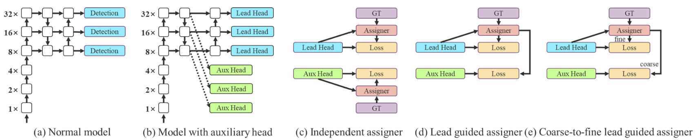

图5:粗的辅助头和细的 lead head 标签分配器。与正常模型(a)相比，(b)中的 schema 有 auxiliary head。不同于通常的独立标签分配器(c)，我们提出(d) lead head 指导标签分配器和(e) coarse-to-fine lead head 指导标签分配器。利用 lead head 预测和 ground truth 优化标签分配器，同时获得训练 lead head 和 auxiliary head 的标签。详细的从粗到细（ coarse-to-fine）的实现方法和约束设计细节将在附录中详细阐述。 

**Lead head guided 标签分配器**主要根据 the lead head 的预测结果和  the ground truth 情况进行计算，并通过优化过程生成软标签。这组软标签将作为  auxiliary head 和 lead head 的目标训练模型。这样做的原因是因为 Lead Head 具有相对较强的学习能力，因此由其生成的软标签应该更能代表源数据和目标数据之间的分布和相关性。此外，我们可以将这种学习视为一种广义残差（ residual）学习。通过让较浅的 auxiliary head 直接学习  lead head 已经学习的信息， lead head 将更能专注于学习尚未学习的 residual 信息。

**由粗到精的 lead head g 指导标签分配器** 还利用  lead head 的预测结果和 ground truth 情况生成软标签。然而，在这个过程中，我们产生了两组不同的软标签，即粗标签和细标签，其中细标签与 lead head 指导标签分配器生成的软标签相同，而粗标签是通过放松正样本分配过程的约束来允许更多的网格被视为正目标来生成的。究其原因， auxiliary head 的学习能力不如 lead head 强，为了避免丢失需要学习的信息，我们会在目标检测任务中重点优化 auxiliary head的recall。对于 lead head 的输出，我们可以从较高的  recall 结果中筛选出 precision 较高的结果作为最终输出。但是，我们必须注意，如果粗标签的附加权重（ additional weight）接近细标签的附加权重（ additional weight），可能会在最终预测时产生较差的先验。因此，为了使这些 extra coarse positive grids 的影响更小，我们在解码器中加入了限制条件，使 extra coarse positive grids 不能完美地产生软标签。上述机制允许 fine label 和 coarse label的重要性在学习过程中动态调整，使 fine label 的可优化上界始终高于coarse label。

### 4.3. 其他可训练的 bag-of-freebies

在这一部分中，我们将列出一些可训练的 bag-of-freebies 。这些  freebies 是我们在训练中使用的一些技巧，但最初的概念并不是我们提出的。这些  freebies 的训练细节将在附录中详细说明，包括：

- conv-bn-activation 拓扑中的 Batch normalization：这部分主要将 Batch normalization 层直接连接到卷积层。这样做的目的是在推理阶段将 Batch normalization 的均值和方差整合到卷积层的 bias 和 weight中。
- 将YOLOR[81]中的隐含知识与卷积特征图相结合，并采用加法和乘法相结合的方式：在推理阶段通过预计算将YOLOR中的隐含知识简化为向量。该向量可与前一卷积层或后卷积层的bias 和 weight 组合。
- EMA模型：EMA是Mean Teacher[75]中使用的一种技术，在我们的系统中，我们纯粹使用EMA模型作为最终的推理模型。

## 5.实验
### 5.1 实验装置

我们使用Microsoft COCO 数据集进行了实验，验证了我们的目标检测方法。我们所有的实验都没有使用预训练好的模型。也就是说，所有的模型都是从头开始训练的。在开发过程中，我们使用 train 2017 set 进行训练，然后使用  val 2017 set 进行验证和选择超参数。最后，我们展示了目标检测在 test 2017 set 上的性能，并与最新的目标检测算法进行了比较。详细的训练参数设置见附录。

我们设计了边缘GPU、普通GPU、云GPU的基本模型，分别命名为 YOLOv7-tiny 、YOLOv7、YOLOv7-W6。同时，我们还使用基本模型对不同的业务需求进行模型缩放，得到不同类型的模型。对于YOLOv7，我们对 neck 进行堆叠缩放，并使用提出的复合缩放方法对整个模型的深度和宽度进行放大，从而得到 YOLOv7-X。对于 YOLOv7-W6，我们使用新提出的复合标度方法得到了 YOLOv7-E6 和YOLOv7-D6。此外，我们将提出的  EELAN 用于 YOLOv7-E6，从而完成YOLOv7E6E。由于YOLOv7-tiny 是一个面向边缘GPU的架构，它将使用  leaky ReLU 作为激活函数。对于其他模型，我们使用  SiLU 作为激活函数。我们将在附录中详细描述每个模型的比例因子。

### 5.2.基线

表1：基线目标探测器的比较。

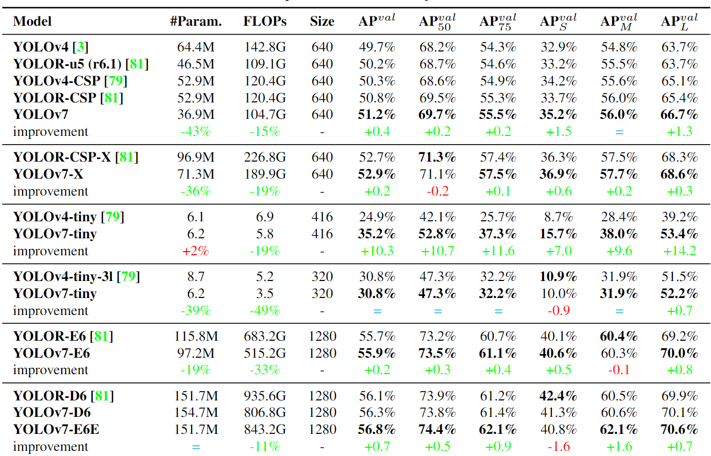

我们选择了先前版本的YOLO[3，79]和最先进的目标检测器YOLOR[81]作为我们的基线。表1显示了我们提出的 YOLOv7 模型与使用相同设置训练的基线的比较。

从结果可以看出，与YOLOv4相比，YOLOv7的参数减少了75%，计算量减少了36%，AP增加了1.5%。与最先进的 YOLOR-CSP 相比，YOLOv7的参数减少了43%，计算量减少了15%，AP增加了0.4%。在性能上，与 YOLOv4-tiny-31 相比， YOLOv7-tiny 在保持AP不变的情况下，参数个数减少了39%，计算量减少了49%。在云GPU模型上，我们的模型仍然可以有更高的AP，同时参数数量减少了19%，计算量减少了33%。

### 5.3.与 state-of-the-arts的比较

表2:最先进的实时目标检测器的比较。

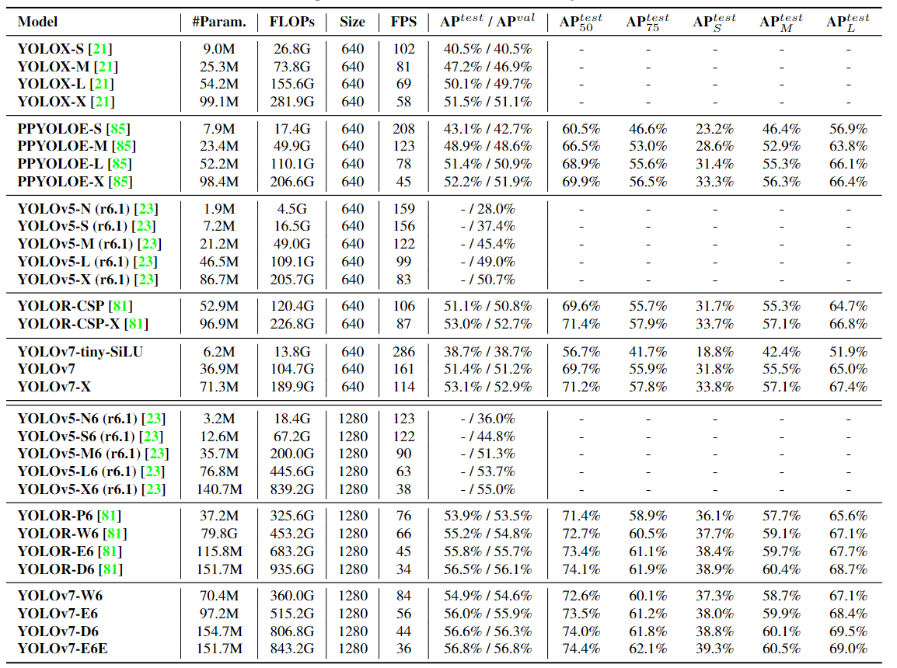

> 我们的  FLOPs 是按矩形输入分辨率计算的，如640×640或1280×1280。 
> 我们的推理时间是通过使用  letterbox  resize 输入图像，使其长边等于640或1280来估计的。

我们将该方法与现有的 general GPUs 和 Mobile GPUs 的目标检测器进行了比较，结果如表2所示。从表2的结果可以看出，该方法综合考虑了速度和精度之间的最佳折衷。如果我们将YOLOv7-Tiny-Silu 与YOLOv5-N(r6.1) 进行比较，我们的方法是127fps 更快，AP上的 accurate 高10.7%。此外，YOLOv7 在161fps的帧率下有51.4%的AP，而具有相同AP的 PPYOLOE-L 只有78fps的帧率。在参数使用方面，YOLOv7 比 PPYOLOE-L 少41%。如果我们比较 YOLOv7-X 114fps的推理速度和 YOLOv5-L(r6.1) 99fps 的推理速度，YOLOv7-X 可以提高3.9%的AP。如果将YOLOv7-X 与类似规模的 YOLOv5-X(r6.1) 进行比较，则YOLOv7-X的推理速度快31fps。此外，在参数和计算量方面，与 YOLOv5-X(r6.1) 相比，YOLOv7-X减少了22%的参数和 8%的计算量，而AP提高了2.2%。

如果使用输入分辨率1280将 YOLOv7 与 YOLOR 进行比较，则 YOLOv7-W6 的推理速度比YOLOR-P6 快8fps，检测率也提高了 1%AP。对于YOLOv7-E6和YOLOv5-X6(r6.1)的比较，前者比后者有 0.9%AP增益，45%更少参数，63%的更少计算量，47%的更快推理速度。YOLOv7-D6的推理速度与 YOLOR-E6 相近，但AP提高了0.8%。YOLOv7-E6E 的推理速度与 YOLOR-D6 相近，但AP提高了0.3%。

## 5.4.消融研究
### 5.4.1提出的复合 scaling 方法

表3：提出的模型 scaling下的消融研究

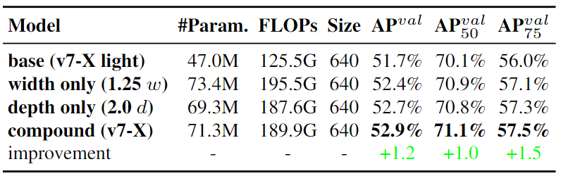

表3显示了使用不同的模型缩放策略进行 scaling up 时所获得的结果。其中，我们提出的复合scaling 方法是将 computational 块的深度放大1.5倍，将 transition 块的宽度放大1.25倍。如果与仅放大宽度的方法相比，我们的方法可以以更少的参数和计算量提高AP 0.5%。如果与仅放大深度的方法相比，我们的方法只需要增加2.9%的参数和1.2%的计算量，可以提高AP 0.2%。从表3的结果可以看出，我们提出的复合缩放策略可以更有效地利用参数和计算。

### 5.4.2 提出的 planned re-parameterized 模型
为了验证我们提出的 planned re-parameterized 模型的通用性，我们分别对基于 concatenation 的模型和基于 residual 的模型进行了验证。我们选择了基于级联的模型和基于residual  的模型进行验证，分别是3层 ELAN 模型和CSPDarknet模型。

在基于 concatenation 模型的实验中，我们用 RepConv 替换了3层 ELAN 中不同位置的 3×3卷积层，具体配置如图6所示。从表4所示的结果可以看出，我们提出的 planned re-parameterized 模型上存在所有较高的AP值。

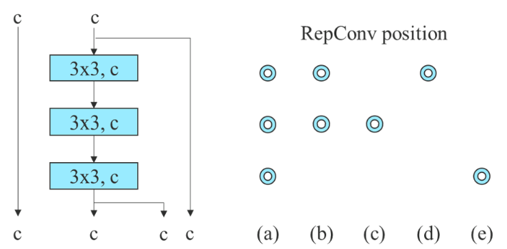

图6： Planned RepConv 3-stacked ELAN。蓝色圆圈是我们用 RepConv 替换Conv的位置。

表4：Planned  RepConcatenation 模型的消融研究。

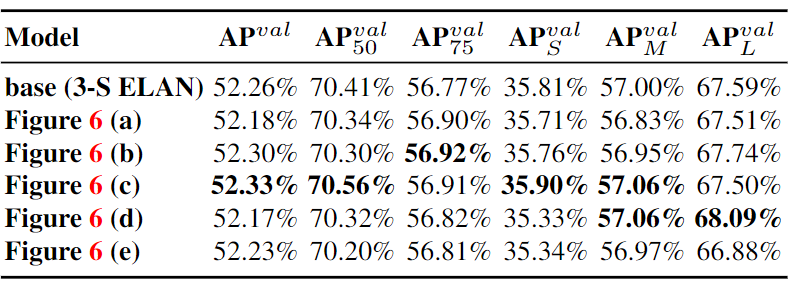

在基于残差模型的实验中，由于原始的黑暗块没有一个符合我们设计策略的3 × 3卷积块，所以我们为实验额外设计了一个反向的黑暗块，其架构如图7所示。由于带有暗块和反向暗块的CSPDarknet 具有完全相同的参数和操作量，所以比较是公平的。表5所示的实验结果充分证明了所提出的 planned re-parameterized 模型对基于残差的模型同样有效。我们发现RepCSPResNet[85]的设计也符合我们的设计模式。

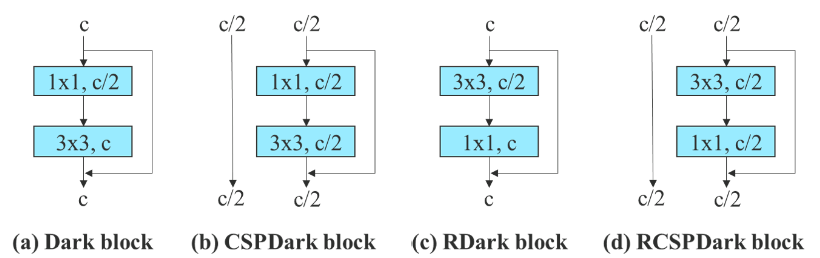

图7：反向 CSPDarknet。我们颠倒了暗块中1×1和3×3卷积层的位置，以符合我们 planned reparameterized 模型设计策略。

表5： planned RepResidual 模型的消融研究。

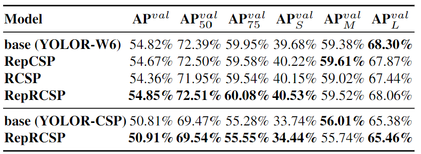

### 5.4.3 提出的 auxiliary head 的 assistant loss

在  auxiliary head  assistant loss 实验中，我们比较了一般的 lead head 和  auxiliary head 的独立标签分配方法，并对两种提出的 lead 指导标签分配方法进行了比较。我们在表6中显示了所有比较结果。从表6中列出的结果可以清楚地看出，任何增加 assistant loss 的模型都可以显著提高整体性能。此外，我们提出的 lead 指导标签分配策略在 AP、AP50和AP75 上获得了比一般独立标签分配策略更好的性能。至于我们提出的 coarse for assistant 和 fine for lead label assignment strategy，它在所有情况下都会得到最好的结果。在图8中，我们展示了不同方法在 auxiliary head 和 lead head 预测的对象图。从图8中我们发现，如果 auxiliary head 学习 lead guided soft label，确实有助于 lead head 从一致的目标中提取残留信息。

表6:提出的auxiliary head 的消融研究。

在表7中，我们进一步分析了所提出的coarse-to-fine lead guided 标签分配方法对 auxiliary head 解码器的影响。也就是说，我们比较了引入上界约束和不引入上界约束的结果。从表中的数字来看，用距离目标中心的距离来约束目标的上限的方法可以获得更好的性能。

表7:约束 auxiliary head 的消融研究。

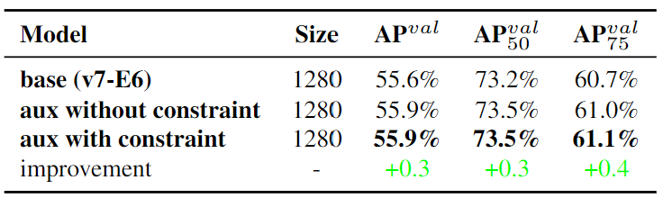

由于提出的 YOLOv7 使用多个金字塔来共同预测目标检测结果，我们可以直接将 auxiliary head 连接到中间层的金字塔进行训练。这种类型的训练可以弥补在下一级金字塔预测中可能丢失的信息。基于上述原因，我们在提出的 E-ELAN 架构中设计了部分 auxiliary head。我们的方法是在合并基数（cardinality）之前，在一组特征图后连接 auxiliary head ，这种连接可以使新生成的特征图 set 的权值不被 assistant loss 直接更新。我们的设计允许每个 lead head 金字塔仍然从不同大小的目标中获取信息。表8显示了两种不同方法的结果，即  coarse-to-fine lead guided 方法 和 partial coarse-to-fine lead guided 方法。显然， partial coarse-to-fine lead guided 方法具有较好的 auxiliary 效果。

表8： partial auxiliary head 的消融研究。

## 8. 更多的比较

YOLOv7 在 5 FPS到160 FPS的速度和 accuracy 上超过了所有已知的目标检测器，在GPU V100上所有已知的30 FPS或更高的实时目标检测器中，YOLOv7具有最高的56.8%的AP  test-dev/ 56.8%的AP min-val 。 YOLOv7-E6 目标检测器(56 FPS V100, 55.9% AP)比基于 transformer 的检测器 SWIN-L Cascade-Mask R-CNN (9.2 FPS A100, 53.9% AP)速度509%， accuracy 2%，基于卷积的检测器 ConvNeXt-XL CascadeMask R-CNN (8.6 FPS A100, 55.2% AP) 速度551%，accuracy  0.7% AP，以及YOLOv7在速度和accuracy 方面优于:YOLOR, YOLOX, scale- yolov4, YOLOv5, DETR， Deformable DETR , DINO-5scale-R50, ViT-Adapter-B 和许多其他目标检测器。此外，我们只在MS COCO数据集上从头开始训练YOLOv7，而不使用任何其他数据集或预训练的权重。

在COCO数据集上，YOLOv7-E6E(56.8%AP)实时模型的最大 accuracy 比目前最 accurate 的 meituan/YOLOv6-s model (43.1% AP)高+13.7%AP。我们的  YOLOv7-tiny (35.2%AP，0.4ms)模型在相同条件下，在COCO数据集和 batch=32 的V100 GPU上，比 meituan/YOLOv6-n(35.0%AP，0.5ms)快+25%和+0.2%AP。

表9：更多比较( (batch=1, no-TRT，无需额外的目标检测训练数据)

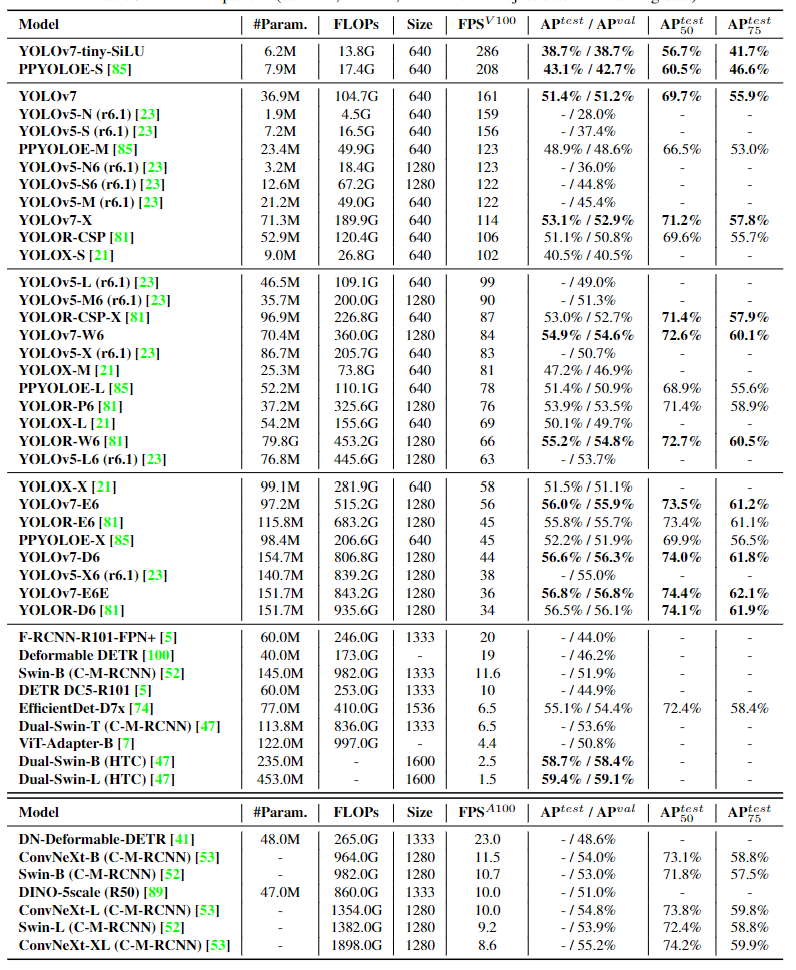

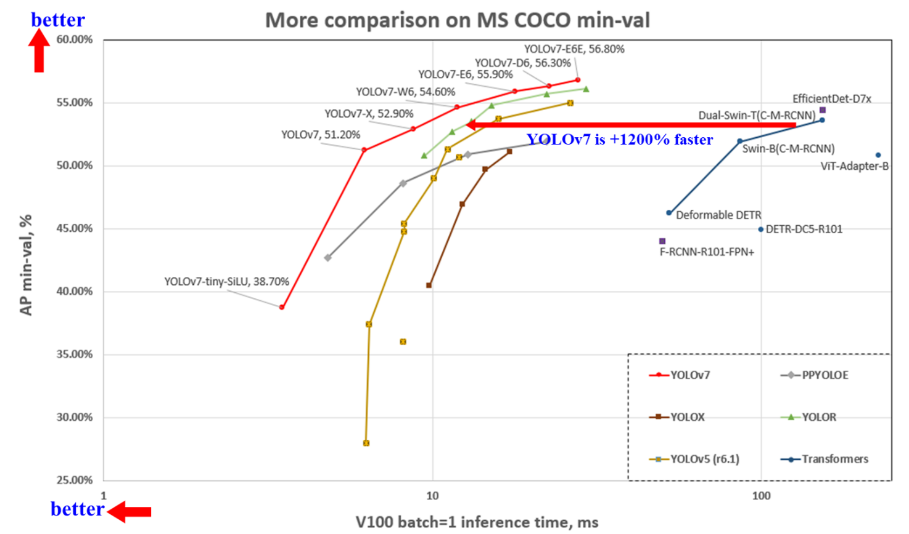

图9：与其他目标检测器的比较。

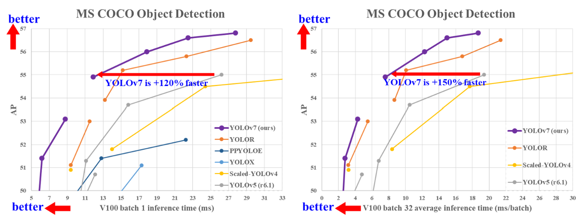

图10：与其他实时目标检测器的比较。

表10：不同设置的比较。

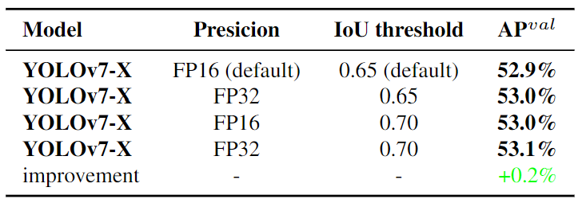

> 与 meituan/YOLOv6 和PPYOLOE类似，当设置较高的IOU阈值时，我们的模型可以获得更高的AP。

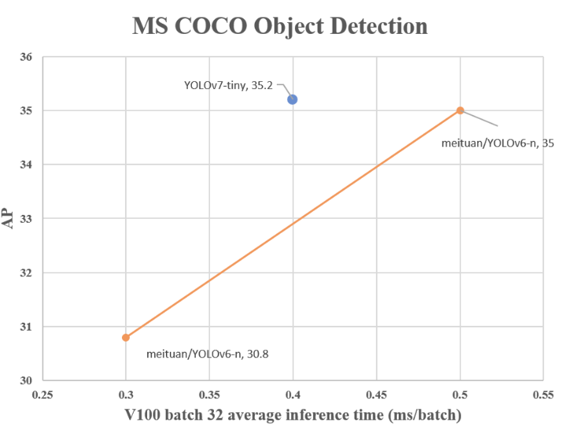

图11：与其他实时目标探测器的比较。
